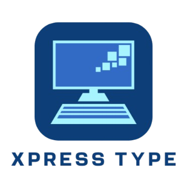

# About

  

This is a typing game named Xpress Type, programmed with Scala 2.12.19 & ScalaFX 8. It's a simple and fun game for you to test your typing speed, you just type in the words shown on screen as fast as possible.

No, it does not measure typing speed in Words Per Minute (WPM). Many other great websites already do that, so I wanted give it a little twist. There's a big difference in terms of how this game assesses typing speed.

The table below shows the program architecture:

<table>
  <tr>
    <th colspan="2">Package</th>
    <th>File</th>
    <th>Description</th>
  </tr>
  <tr>
    <td rowspan="3">resources</td>
    <td>game.view</td>
    <td>All .fxml files + Stylecheet.css</td>
    <td>Contains all user interface files with styling</td>
  </tr>
  <tr>
    <td>images</td>
    <td>All .png or .jpg files</td>
    <td>Contains all images in the program</td>
  </tr>
  <tr>
    <td>texts</td>
    <td>words.txt</td>
    <td>Contains list of all default words</td>
  </tr>
  <tr>
    <td rowspan="20">scala</td>
    <td rowspan="5">game.model</td>
    <td>Animation.scala</td>
    <td>Abstract class for the animations</td>
  </tr>
  <tr>
    <td>BoulderAnimation.scala</td>
    <td>Represents throwing the boulder</td>
  </tr>
  <tr>
    <td>GroundAnimation.scala</td>
    <td>Represents the moving ground</td>
  </tr>
  <tr>
    <td>RunnerAnimation.scala</td>
    <td>Represents the stickman actions: Run, jump & fall</td>
  </tr>
  <tr>
    <td>Score.scala</td>
    <td>Case class for storing final scores</td>
  </tr>
  <tr>
    <td rowspan="6">game.util</td>
    <td>EasyWordGetter.scala</td>
    <td>Retrieve easy words with <= 5 letters</td>
  </tr>
  <tr>
    <td>HardWordGetter.scala</td>
    <td>Retrieve hard words with >= 9 letters</td>
  </tr>
  <tr>
    <td>MediumWordGetter.scala</td>
    <td>Retrieve medium words with 6-8 letters</td>
  </tr>
  <tr>
    <td>ScoreTracker.scala</td>
    <td>Keeps track of scores during the game</td>
  </tr>
  <tr>
    <td>WordGetter.scala</td>
    <td>Retrieves all words from a text file</td>
  </tr>
  <tr>
    <td>WordSelector.scala</td>
    <td>Picks a random word from the word pool</td>
  </tr>
  <tr>
    <td rowspan="8">game.view</td>
    <td>DifficultyChoiceController.scala</td>
    <td>Controls the screen for choosing difficulty</td>
  </tr>
  <tr>
    <td>GameScreenController.scala</td>
    <td>Controls the screen for the game itself. Contains the game logic</td>
  </tr>
  <tr>
    <td>HowToPlayController.scala</td>
    <td>Controls the screen for showing instructions on how to play the game</td>
  </tr>
  <tr>
    <td>KeyboardTestController.scala</td>
    <td>Controls the screen for testing keyboard functionality</td>
  </tr>
  <tr>
    <td>MainMenuController.scala</td>
    <td>Controls the screen for the main menu</td>
  </tr>
  <tr>
    <td>MenuBarController.scala</td>
    <td>Controls the menu bar on top of the app</td>
  </tr>
  <tr>
    <td>ScoreStatsController.scala</td>
    <td>Controls the screen for showing score stats</td>
  </tr>
  <tr>
    <td>TextLoaderController.scala</td>
    <td>Controls the screen for loading own set of words to type during the game</td>
  </tr>
  <tr>
    <td>game</td>
    <td>Application.scala</td>
    <td>The main file to run the program. Also contains the code to load all .fxml files</td>
  </tr>
</table>

## How to Play

*TODO
